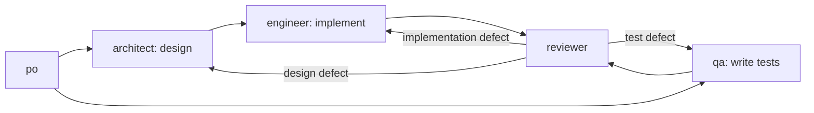

# Design: agent-factory-icv — parallel design/implement + write-tests tracks

## Approach

Two changes, both scoped to the *target project's* flow (the `agents/*.md` prompts and
`bin/new-story.sh` that ship with this kit and get run against/inside the project being built —
not this repo's own self-hosting `CLAUDE.md`, which is unrelated):

1. **Dependency graph** (`bin/new-story.sh`): `design` and `write-tests` become independent roots;
   `implement` depends only on `design`; `verify` depends on both `implement` and `write-tests`;
   `review` depends only on `verify` (unchanged). No new issue types, no new `bd` features — just
   a different wiring of the same five issues.
2. **Branching**: two short-lived *track* branches, both cut from `story/<id>`, one per parallel
   track:
   - `story/<id>-design` — architect (design) then engineer (implement) commit here.
   - `story/<id>-tests` — qa (write-tests) commits here.

   Each track's branch is merged into the shared `story/<id>` by whichever role finishes that
   track's *last* stage before the next stage needs the merged result: engineer merges
   `story/<id>-design` in as part of closing `implement` (AC7); qa merges `story/<id>-tests` in as
   part of starting `verify` (AC8), before running tests against the merged code. `story/<id>`
   itself is never written to directly by architect or the write-tests qa session — only by
   engineer's and qa's merge commits, and (as today) by the reviewer's final merge to `main`. This
   is what keeps AC6 true: the two concurrent sessions (design-track vs write-tests-track) never
   touch the same branch.

   No new branch-naming concept is introduced beyond what already exists: `story/<id>` is already
   "check it out if it exists on origin, else create it from origin/main" (CLAUDE.project.md,
   `po.md`). The track branches use the exact same rule, just checked against `story/<id>` instead
   of `origin/main` as the creation base. That single rule, applied uniformly, is what lets it
   double as the rework mechanism too (see "Rework" below) — a rework session finds its track
   branch already exists on origin and continues on it rather than starting fresh.

   `agent-loop.sh` needs no change: it only resets each role's persistent workspace clone to
   `main` between sessions (`sync_repo`); which branch a session works on inside that clone is
   entirely a matter of the shell commands the agent runs per CLAUDE.project.md/role-prompt
   instructions, already generic to any branch name. Same for `board.sh` — it renders whatever
   `bd ready`/`bd list` returns with no assumption that exactly one issue per story is ever ready
   at once, so two simultaneously-ready issues (design and write-tests) render correctly
   unmodified.

## Dependency graph changes — `bin/new-story.sh`

Current:
```
d=$(mk architect design ...)
t=$(mk qa        tests  ...)
i=$(mk engineer  implement ...)
v=$(mk qa        verify ...)
r=$(mk reviewer  review ...)

bd dep add "$t" "$d"   # tests depend on design
bd dep add "$i" "$t"   # implement depends on tests
bd dep add "$v" "$i"   # verify depends on implement
bd dep add "$r" "$v"   # review depends on verify
```

New:
```
bd dep add "$i" "$d"   # implement depends on design only
bd dep add "$v" "$i"   # verify depends on implement
bd dep add "$v" "$t"   # verify ALSO depends on write-tests
bd dep add "$r" "$v"   # review depends on verify
```
(`$t` gets no incoming dep — it's ready the moment the story exists, same as `$d`.)

Also update:
- The write-tests issue description (currently "Write acceptance tests from the story's
  acceptance criteria (before implementation exists)") to explicitly say it must not read or
  reference `docs/design/<id>.md` — covers AC2. Existing wording already avoids referencing the
  design doc; just make the constraint explicit: `"Write acceptance tests from the story's
  acceptance criteria only — do not read or depend on docs/design/$sid.md, which may not exist yet
  or may still be changing. $ctx"`.
- The header comment describing the chain shape (currently `design -> tests -> implement -> verify
  -> review`) to describe the fork/join instead.
- `ctx` stays as-is (`Branch: story/$sid.`) — each role prompt now derives its own track branch
  name from that base, so no new variable is needed in `new-story.sh` itself.

This fully satisfies AC1, AC3, AC4, AC5: `bd show` on a freshly-created story shows `design` and
`write-tests` both ready with no edge between them, `implement` shows exactly one blocker
(`design`), `verify` shows exactly two blockers (`implement`, `write-tests`), `review` shows
exactly one blocker (`verify`).

## Role prompt changes

### `agents/architect.md` (stage:design)
After "Read the story..." add the branch step, mirroring the existing `story/<id>` convention:
```
Check out story/<story-id> and pull. Then check out story/<story-id>-design: if it exists on
origin, check it out and pull; otherwise create it from your freshly-pulled story/<story-id>. Do
all your work (docs/design/<story-id>.md, ARCHITECTURE.md on the first story) on
story/<story-id>-design, not on story/<story-id> directly — commit and push there. You never touch
story/<story-id> itself.
```
Step 5 ("Commit, push...") changes from "close your issue" to "push `story/<story-id>-design`,
`bd comment` the key decisions, close your issue" (branch name made explicit so there's no
ambiguity which branch gets pushed).

Add a new top-level case, **stage:rework** (design was wrong; reviewer found the defect):
```
**stage:rework**
The issue describes a design defect found by the reviewer. Check out story/<story-id>-design (it
already exists — reuse it, do not recreate it) and pull story/<story-id> first to make sure you're
starting from the latest merged code. Fix docs/design/<story-id>.md (and ARCHITECTURE.md if the
mistake was there), commit, push story/<story-id>-design.

This always requires re-implementation, so before closing:
1. Create a new engineer issue: `bd create "Re-implement per corrected design/<story-id>.md: <one-line
   summary of what changed>" -t task -p 2 -l role:engineer,stage:rework,story:<story-id> -d
   "Check out story/<story-id>-design (pull it — the architect just pushed a fix), re-implement
   against the corrected docs/design/<story-id>.md, then merge story/<story-id>-design into
   story/<story-id> before closing, same as the original implement stage. Story:
   docs/stories/<story-id>.md. Conventions: CLAUDE.md." --json`
2. `bd dep add <new-engineer-issue> <your-issue>` (sequencing: it can't start until your fix is
   pushed).
3. Find what your issue blocks: `bd show <your-issue>` — the reviewer's review issue is listed
   under BLOCKS. Extend ITS blockers to also require the new engineer issue:
   `bd dep add <review-issue> <new-engineer-issue>`. (Your issue closing already unblocks nothing
   on its own now — the review issue stays blocked until the new engineer issue also closes.)
4. `bd comment` what was wrong and what changed, close your issue.
```
This satisfies AC9: design rework always re-triggers engineer via the newly created chained
issue, and neither the write-tests nor verify issue is touched (nothing in this flow references
them).

### `agents/engineer.md` (stage:implement, stage:rework)
Replace "Check out `story/<story-id>` and pull." with:
```
Check out story/<story-id>-design and pull (the architect pushed the design there — see the
issue's linked design work). Read docs/stories/<story-id>.md, docs/design/<story-id>.md,
docs/ARCHITECTURE.md.
```
(This applies to `stage:implement` specifically — the first bullet under it already says "Read
docs/stories/... docs/design/...", so just fold the branch instruction into the shared preamble
above the two stage sub-sections, since rework also needs a branch step but a different one — see
below.)

Add to the end of the **stage:implement** finish step (currently "everything committed and
pushed, full suite green..."), before the `bd comment`/close:
```
Before closing: `git checkout story/<story-id> && git pull && git merge --no-ff
story/<story-id>-design -m "[<your-issue>] Merge story/<story-id>-design into story/<story-id>"`,
re-run the full suite on the merged result (the merge itself can surface conflicts or breakage
the design-branch tests didn't catch), then `git push origin story/<story-id>`.
```
This satisfies AC7.

**stage:rework** changes from generic ("Reproduce it, fix it...") to branch-aware, since two
different kinds of engineer rework now exist and the issue description (written by whichever role
filed it) says which:
```
**stage:rework**
The issue describes a defect found by QA or the reviewer; its description says which branch to
work on:
- If it names story/<story-id>-design (architect just pushed a corrected design — a design-rework
  follow-up): check it out, pull, re-implement, then merge it into story/<story-id> exactly as in
  stage:implement's finish step above, before closing.
- Otherwise (an implementation-only defect — design was sound): check out story/<story-id> and
  pull; commit the fix directly there (no track branch — nothing else is concurrently using
  story/<story-id> at this point in the chain).
Reproduce it, fix it with a regression test, run the full suite, push.
```
This satisfies AC10 (implementation-only defects touch only `story/<story-id>` directly, nothing
filed against architect or qa) and the engineer half of AC9/AC11 (design-rework and test-rework
follow-ups both know to use/merge the design branch when that's what's named).

### `agents/qa.md` (stage:tests, stage:verify, stage:rework)
Change the intro line from "Your issue is `stage:tests` or `stage:verify`." to "Your issue is
`stage:tests`, `stage:verify`, or `stage:rework`."

**stage:tests** gets a branch step and a reworded step 1 constraint (AC2):
```
**stage:tests** (runs BEFORE any implementation exists, and does not require docs/design/<story-id>.md to exist)
1. Check out story/<story-id> and pull. Then check out story/<story-id>-tests: if it exists on
   origin, check it out and pull; otherwise create it from your freshly-pulled story/<story-id>.
   Do all your work there, not on story/<story-id> directly.
2. Read the story ONLY — not docs/design/<story-id>.md, which may not exist yet or may still be
   changing in parallel. Write acceptance tests derived ONLY from the acceptance criteria - one or
   more tests per criterion, named so the criterion is traceable (e.g. `test_ac3_...`).
3. Run them: they should fail (or be skipped as not-implemented) for the right reason...
4. Commit, push story/<story-id>-tests, `bd comment` which criteria map to which tests, close.
```

**stage:verify** gets a branch/merge step before its existing step 1 (AC8):
```
**stage:verify** (implementation is done)
1. Check out story/<story-id> and pull (this already has the design track's merge — see
   engineer's stage:implement). Merge your write-tests work in: `git merge --no-ff
   story/<story-id>-tests -m "[<your-issue>] Merge story/<story-id>-tests into story/<story-id>"`,
   push story/<story-id>. Now run the full test suite against this merged result...
   [rest unchanged: exercise the behaviour for real, walk every AC, add edge cases]
2. All good: commit any added tests, push story/<story-id>, `bd comment` the evidence, close.
3. Defects: [unchanged — files role:engineer,stage:rework bugs against story/<story-id> directly,
   since implementation-only defects found here never touch story/<story-id>-design or
   story/<story-id>-tests]
4. [unchanged]
```

Add **stage:rework** (test-track rework — the reviewer found the *tests* were wrong, not the
implementation):
```
**stage:rework** (the reviewer found a problem with the tests themselves; design was sound — do
not touch docs/design/<story-id>.md)
1. Check out story/<story-id> and pull. Fix the tests directly there (no track branch — both
   tracks are already merged in by this point in the chain; nothing else is concurrently using
   story/<story-id>).
2. Run the corrected tests against the implementation already in story/<story-id>.
3. If they pass: commit, push, `bd comment` what was wrong and how it was fixed, close (this
   unblocks the review issue, same as any other rework).
4. If they still fail against the implementation: the corrected tests have now surfaced a real
   implementation defect. Handle it exactly like a stage:verify defect (step 3 there) — file a
   `role:engineer,stage:rework` bug linked with `discovered-from`, make your issue depend on it,
   set your issue back to open, and stop. Do not file a second round of qa rework for the same
   finding.
```
This satisfies AC11: qa rework never touches the architect's design, and a test-fix that then
fails against the implementation produces exactly one new engineer rework issue, not a second qa
round.

### `agents/reviewer.md`
The **Request changes** section currently only describes filing `role:engineer` bugs. Split it by
what's actually at fault, all using the same discovered-from + dep-add pattern already documented,
just with the label and target changed:
```
**Request changes**: for each blocking finding, create an issue targeting whichever role is
actually at fault:
- Implementation defect (design was sound): `bd create "<finding, file:line, why it matters, what
  good looks like>" -t bug -p 1 -l role:engineer,stage:rework,story:<story-id>`.
- Design defect: `bd create "<finding, why the design is wrong, what should change>" -t bug -p 1 -l
  role:architect,stage:rework,story:<story-id>`. (The architect's own rework flow takes care of
  chaining a follow-up engineer re-implementation issue and re-wiring your review issue to depend
  on it too — you only need to link the architect issue, not the eventual engineer one.)
- Test-quality gap (tests are weak/wrong, implementation may be fine): `bd create "<finding, why
  the test is wrong, what a correct test should assert>" -t bug -p 1 -l role:qa,stage:rework,story:<story-id>`.

Whichever kind: link it (`bd dep add <finding> <your-issue> --type discovered-from`), make your
issue depend on it (`bd dep add <your-issue> <finding>`), set your issue back to open (`bd update
<your-issue> --status open`), and stop.
```
This satisfies AC9 (review issue ends up depending on the eventual engineer follow-up via the
architect's own rework flow, design/qa untouched), AC10 (engineer-only, nothing else touched),
AC11 (qa, with engineer only pulled in if the corrected tests still fail — handled inside qa's
stage:rework, not by the reviewer at all).

### `agents/CLAUDE.project.md` (shared conventions template copied into target projects)
Update the "Git" section's branch bullet to mention track branches, since it's currently the only
place that states the "story/<id> is the only branch" rule that this story changes:
```
- All work for a story happens on the branch `story/<story-id>`, except the design track
  (architect + the engineer who implements it) and the write-tests track (qa's write-tests stage),
  which each work on their own branch cut from `story/<story-id>` — `story/<story-id>-design` and
  `story/<story-id>-tests` respectively — merged back into `story/<story-id>` before the next
  stage needs the result. See the role prompt (`agents/<role>.md`) for exactly when to check out,
  create, and merge each. If a branch already exists on origin, check it out and pull; otherwise
  create it from the base named above.
```

## Branch lifecycle summary (all ACs at a glance)

| Stage | Branch checked out | Branch pushed to | Merge performed |
|---|---|---|---|
| po: new story | `story/<id>` created from `origin/main` | `story/<id>` | — |
| architect: design | `story/<id>-design` created from `story/<id>` | `story/<id>-design` | — |
| qa: write-tests | `story/<id>-tests` created from `story/<id>` | `story/<id>-tests` | — |
| engineer: implement | `story/<id>-design` | `story/<id>-design`, then `story/<id>` | `story/<id>-design` → `story/<id>` |
| qa: verify | `story/<id>` | `story/<id>` | `story/<id>-tests` → `story/<id>` |
| reviewer: review/approve | `story/<id>` | `main` (on approve) | `story/<id>` → `main` |
| architect: rework (design) | `story/<id>-design` (reused) | `story/<id>-design` | — (engineer's follow-up re-implement issue merges it, same as implement) |
| engineer: rework (impl-only) | `story/<id>` | `story/<id>` | — |
| qa: rework (tests) | `story/<id>` | `story/<id>` | — |

design and write-tests never write to `story/<id>` directly (AC6); every track's own branch is
merged into `story/<id>` exactly once per pass, by the role whose stage needs the merged result
next (AC7, AC8).

## README changes

Replace the "Flow" section's step 2 and step 4 wording (linear chain) with a description of the
fork/join, and add a mermaid diagram. Suggested diagram, placed right after the existing ASCII
box in the intro (or replacing step 2's prose with a pointer to it):


(Verify is qa's second stage, gating the merge into review; it can be folded into the `qa1` node
label as "qa: write tests / verify" to keep the diagram to one qa node, matching AC12's requirement
that the diagram show `qa` once as a parallel branch — the two-phase nature of qa's work is
already covered in the prose immediately below it.)

Flow section rewrite (step 2 and step 4):
```
2. **po** writes `docs/stories/<id>.md` on branch `story/<id>` and runs `new-story.sh`, which
   creates two issues with no dependency on each other — design (architect) and write-tests (qa,
   scoped to the story's acceptance criteria only, not the design) — plus implement (engineer,
   depends on design), verify (qa, depends on BOTH implement and write-tests), and review
   (reviewer, depends on verify).
...
4. Each agent polls `bd ready --label role:<me>`, claims one issue, runs one fresh Claude session
   on it, and closes it, which unblocks the next stage. Design (architect → engineer) and
   write-tests (qa) run in parallel on their own branches (`story/<id>-design`,
   `story/<id>-tests`); each is merged into the shared `story/<id>` before the next stage that
   needs it (engineer merges design in before implement closes; qa merges tests in at the start of
   verify). Only the reviewer merges `story/<id>` to `main`.
5. Reviewer/QA defects become `stage:rework` issues targeting whichever role is at fault — engineer
   (implementation only), architect (design — which itself re-triggers a follow-up engineer
   re-implementation), or qa (tests — which re-triggers engineer only if the corrected tests then
   fail against the implementation). Each rework path leaves the other two roles' work untouched.
   After 2 rework rounds a story goes to `needs-human`.
```
This satisfies AC12 and AC13.

## Test strategy (for QA)

No unit-test framework exists or is warranted here (`docs/ARCHITECTURE.md` "Test strategy") — this
is bash + `bd` graph shape + prose. QA should verify with real commands against a scratch story,
not by reading the scripts:

1. **AC1/AC3/AC4/AC5 (graph shape)**: run `bin/new-story.sh smoke-xyz "smoke"` against a real (or
   throwaway) Beads DB, then `bd show <design-id>`, `bd show <tests-id>` and confirm neither
   depends on the other and `bd ready` lists both. `bd show <implement-id>` should list exactly
   `design` under blocked-by. `bd show <verify-id>` should list exactly `implement` and
   `write-tests`. `bd show <review-id>` should list exactly `verify`.
2. **AC2**: grep the write-tests issue's `-d` description text (from `bd show <tests-id> --json`)
   for the absence of `docs/design` and presence of "acceptance criteria only" wording (exact
   string TBD by whatever new-story.sh ships).
3. **AC6-AC8 (branching)**: this needs an actual run-through with real architect/qa/engineer
   sessions (or a scripted stand-in that does the same `git` commands the prompts specify) against
   a scratch project: confirm `story/<id>-design` and `story/<id>-tests` both exist on origin after
   design+write-tests close, confirm neither branch's commits appear on `story/<id>` until
   engineer/qa's respective merge step runs, and confirm `story/<id>` has exactly the two expected
   merge commits (one from engineer, one from qa) by the time verify starts running tests.
4. **AC9-AC11 (rework)**: three scenarios, each starting from a completed story sitting at review:
   have the reviewer file each kind of rework issue and confirm (a) the graph after filing shows
   only the intended role's issue as a new blocker of review, (b) for the design case specifically,
   that closing the architect rework issue results in a NEW engineer issue appearing that also
   blocks review (not just the architect issue), and (c) for the test case, that a still-failing
   corrected test produces exactly one new `role:engineer,stage:rework` issue and no second qa
   issue.
5. **AC12/AC13**: read `README.md`, confirm the mermaid block parses (any mermaid linter, or just
   visual render) and shows `po` forking into `architect`+`qa`, both merging before `reviewer`,
   with three labelled reviewer arrows back out; confirm the Flow section prose no longer
   describes a single linear five-stage chain.

Given this kit's existing test strategy (acceptance-style, no framework), QA is expected to spot-
check items 1-2 and 5 with real `bd`/`git`/read commands during the `tests` stage (they don't
require a live implementation), and defer 3-4 to `verify` once engineer's branch-merge behavior
actually exists to exercise.
